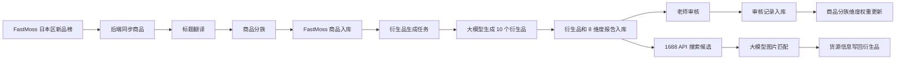

# 后端业务逻辑文档

## 1. 总体链路



## 2. FastMoss 同步

入口：

```text
POST /api/fastmoss/sync-products
```

服务文件：

```text
backend/app/services/fastmoss_service.py
```

核心逻辑：

1. 读取 `third_party_configs` 中启用的 `fastmoss` 配置。
2. 调用 FastMoss 日本区新品榜接口。
3. 请求参数包含：
   - 日本区。
   - 跨境商品：是。
   - 全托管商品：否。
   - 日期：当前日期向前 4 天。
4. 清除旧 FastMoss 商品数据。
5. 解析商品列表。
6. 调用大模型翻译标题。
7. 提取商品分族。
8. 保存商品到 `fm_products`。
9. 写入 `fastmoss_sync_logs`。

入库字段：

- FastMoss 商品 ID。
- 平台和榜单类型。
- 中文标题。
- 图片 URL。
- 价格。
- 币种。
- 销量。
- 排名。
- 类目。
- 店铺。
- 来源链接。
- 请求日期。
- 原始 JSON。
- 商品分族 ID。

## 3. 标题翻译

服务文件：

```text
backend/app/services/fastmoss_service.py
```

模型调用：

```text
backend/app/services/ai_model_service.py
```

规则：

- 使用当前默认可用模型。
- 翻译成简体中文。
- 翻译失败时保留原始标题，不能阻断 FastMoss 入库。
- 翻译不需要深度思考模式。

## 4. 商品分族

服务文件：

```text
backend/app/services/product_family_service.py
```

核心目的：

用稳定商品方向承载权重，而不是用一次 FastMoss 原商品 ID 承载权重。

处理逻辑：

1. 根据商品标题和类目提取关键词。
2. 判断商品所属大方向和细分变体。
3. 生成 `family_key`。
4. 写入或复用 `product_families`。
5. 初始化该分族的 8 个维度权重。

示例：

- “捏捏乐硅胶玩具”
- “捏捏乐水晶玩具”

这类商品应尽量进入相近的商品分族或规则链路，便于复用老师历史审核经验。

## 5. 选品维度

当前固定 8 个维度：

| 编码 | 名称 | 初始权重 |
| --- | --- | --- |
| dimension_1 | 使用场景 | 12.5% |
| dimension_2 | 商品周期性 | 12.5% |
| dimension_3 | 目标群体 | 12.5% |
| dimension_4 | 短视频流量种草适配能力 | 12.5% |
| dimension_5 | 日本市场偏好 | 12.5% |
| dimension_6 | 是否属于新奇特商品 | 12.5% |
| dimension_7 | 复购属性 | 12.5% |
| dimension_8 | 竞品属性 | 12.5% |

数据库表：

- `selection_attributes`
- `product_family_dimension_weights`

## 6. 衍生品生成

服务文件：

```text
backend/app/services/selection_derivation_service.py
```

主要入口：

```text
generate_derivatives_for_products(db, products)
generate_derivatives_for_product_ids(product_ids)
```

输入：

- 原商品 ID。
- 原商品标题。
- 原商品图片 URL。
- 选品提示词。
- 商品分族维度权重。

模型提示词要求：

- 角色：TikTok 日本站跨境专业选品分析师。
- 基于商品标题和商品图片。
- 分析相关衍生品 10 个。
- 遵守日本地区禁售、禁运、物流和平台规则。
- 输出 8 个固定维度。
- 没有依据的结论标注“无充足依据，仅作参考线索”。

输出入库：

- `derived_product_recommendations`
- `derived_product_dimension_reports`

注意：

- 每个原商品目标生成 10 个衍生品。
- 生成时会绑定 `source_product_id`。
- 生成时会绑定 `family_id`。
- 生成新 pending 衍生品前，会清理同原商品下旧的 pending 衍生品。
- 已经被老师审核过的数据不应被随意覆盖。

## 7. 老师审核

接口：

```text
GET /api/teacher/products
GET /api/teacher/products/{product_id}/derived-products
POST /api/teacher/derived-products/{derived_id}/reject
POST /api/teacher/derived-products/{derived_id}/approve
GET /api/teacher/review-records
```

当前前端主要使用拒绝逻辑。

拒绝时入参：

```json
{
  "attribute_ids": [1],
  "review_comment": "周期性不符合"
}
```

后端处理：

1. 更新衍生品 `review_status = rejected`。
2. 写入 `teacher_review_records`。
3. 根据选择的属性找到对应维度。
4. 调整 `product_family_dimension_weights`。

## 8. 权重学习

服务文件：

```text
backend/app/services/product_family_service.py
```

拒绝逻辑：

- 被拒绝的维度权重下降。
- 其他维度权重重新归一化。
- `reject_count` 增加。
- `total_review_count` 增加。

通过逻辑：

- 可增加分族整体通过统计。
- 当前前端已按业务要求去掉通过按钮，但后端仍保留接口能力。

后续模型生成时：

- 系统读取当前商品分族 8 个维度权重。
- 将权重百分比传给模型。
- 模型应有意识偏向高权重维度，谨慎处理低权重维度。

## 9. 1688 匹配

服务文件：

```text
backend/app/services/supplier_1688_service.py
```

接口：

```text
POST /api/suppliers/1688/search
POST /api/suppliers/1688/derived-products/{derived_id}/search
POST /api/suppliers/1688/derived-products/{derived_id}/auto-match
POST /api/suppliers/1688/derived-products/auto-match
```

匹配逻辑：

1. 根据衍生品搜索关键词或名称请求 1688 API。
2. 分页拉取候选商品。
3. 每批候选只取 1688 首图 URL 给大模型。
4. 大模型基于“衍生品名称 + 1688 首图 URL”返回匹配度。
5. 匹配度达到阈值后停止搜索。
6. 将 1688 商品信息写回衍生品。

默认参数：

- 匹配阈值：90。
- 最大候选数：200。
- 每页数量：20。

写回字段：

- `supplier_product_id`
- `supplier_title`
- `supplier_image_url`
- `supplier_price`
- `supplier_sales_count`
- `supplier_shop_name`
- `supplier_source_url`
- `supplier_match_score`
- `supplier_match_report`
- `supplier_raw_data`
- `supplier_search_status`

## 10. 定时任务

脚本：

```text
backend/scripts/daily_fastmoss_pipeline.py
```

线上要求：

- 每天 8:30 执行一次。
- 同步 FastMoss 新品榜。
- 同步完成后触发衍生品生成。

执行结果输出 JSON，包括：

- 同步统计。
- 请求日期。
- 商品数量。
- 衍生品生成结果。

## 11. 前端交互

前端核心文件：

```text
desktop/app/main.py
```

后端调用封装：

```text
DataGateway
```

典型交互：

- 页面刷新时从后端拉取商品、模型、配置、选品属性。
- 教师看板点击原商品后请求该商品衍生品。
- 拒绝衍生品时提交审核记录。
- 管理员切换配置菜单时重新拉取后端数据。

